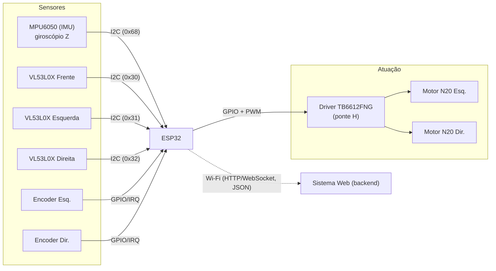
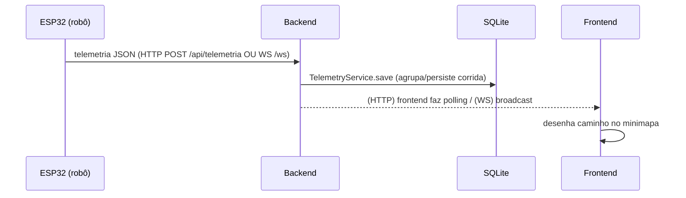

# Estado Atual e Arquitetura — MrBombastic (Micromouse, Grupo 01)

> Documento de levantamento técnico. Faz o **scan das branches**, explica **o que cada parte do projeto faz** (com foco no **Firmware** e na **comunicação entre o hardware e o sistema web**), e identifica os **gaps** de implementação e refatoração.
>
> Escopo analisado: `develop`, `feat/web_socket`, `feat/arquitetura-fsm-imu`, `Firmware`, `SW_97-salvamento-corridas`.

---

## 1. Mapa das branches (o código está fragmentado)

O trabalho de software vive em branches diferentes que **ainda não convergiram**. Este é o fato mais importante do estado atual.

| Branch | Foco | Estado |
|--------|------|--------|
| **`develop`** | Integração oficial | Web pronto (backend HTTP + frontend). Firmware **antigo** (estrutura #74, comms HTTP não integrada). Sem WebSocket. Frontend com testes Vitest. |
| **`feat/arquitetura-fsm-imu`** | **Resolução do labirinto** (rato) | Firmware **reescrito**: Flood Fill + navegação por PID + encoders + IMU. **Removeu a comunicação com a web.** É o estado de referência para a navegação. |
| **`feat/web_socket`** | Telemetria em tempo real | **Spike** de WebSocket no backend (lib `ws`). Não integrado ao frontend nem ao firmware. |
| **`Firmware`** | Firmware base | Antigo (Issue #74): teste de movimentação hardcoded + drivers básicos. Superado pela `feat/arquitetura-fsm-imu`. |
| **`SW_97-salvamento-corridas`** | Salvamento de corridas | Já **mergeado** na `develop` (PR #98). |

**Resumo:** a resolução do labirinto está numa branch (`feat/arquitetura-fsm-imu`) que **não fala com a web**; a web e a telemetria estão em outras branches (`develop` + `feat/web_socket`) que **não têm a navegação nem o firmware integrado**. Ninguém tem o fluxo completo ponta a ponta.

---

## 2. Hardware e como os componentes se comunicam (Firmware)

Plataforma: **ESP32** (`board = esp32dev`, framework Arduino, PlatformIO). Pinos e endereços em `src/firmware/src/config/pinos.h`.

### 2.1 Componentes e barramentos



### 2.2 Como cada barramento funciona

- **I2C (SDA=21, SCL=22, 400 kHz)** — barramento compartilhado por **4 sensores**:
  - **MPU6050 (IMU)** no endereço fixo `0x68`. Fornece a **velocidade angular no eixo Z** (giro), integrada em **ângulo (heading)** — é a referência de rumo para andar reto e girar 90°/180°.
  - **3× VL53L0X (ToF)** — todos nascem com o **mesmo endereço padrão**, então cada um tem um pino **XSHUT** (26, 4, 23) usado no boot para ligá-los **um de cada vez** e reatribuir endereços únicos (`0x30`, `0x31`, `0x32`). Medem **distância até as paredes** (frente/esquerda/direita) em mm.
- **Encoders de quadratura (GPIO com interrupção)** — esquerdo (32/33) e direito (34/35), lidos pela lib `ESP32Encoder`. Fornecem **odometria** (distância percorrida em cm) para medir "uma célula".
- **Driver de motor TB6612FNG (GPIO + PWM)** — ponte H de 2 canais (AIN1/AIN2/PWMA e BIN1/BIN2/PWMB) + `STBY` (pino 5). O ESP32 controla direção (IN1/IN2) e velocidade (PWM) de cada **motor N20**.
- **Wi-Fi (ESP32 → Web)** — o único canal para o sistema web. Envia **telemetria em JSON**. Hoje esse canal está **desligado** na branch da navegação (ver §5).

### 2.3 Mapa de pinos (referência)

| Função | Pino(s) ESP32 |
|--------|---------------|
| I2C SDA / SCL | 21 / 22 |
| ToF XSHUT (F/E/D) | 26 / 4 / 23 |
| Motor A (IN1/IN2/PWM) | 13 / 25 / 18 |
| Motor B (IN1/IN2/PWM) | 14 / 27 / 19 |
| Driver STBY | 5 |
| Encoder Esq. (A/B) | 32 / 33 |
| Encoder Dir. (A/B) | 34 / 35 |

Libs (PlatformIO): `pololu/VL53L0X`, `adafruit/Adafruit MPU6050` (+ Unified Sensor), `madhephaestus/ESP32Encoder`, `bblanchon/ArduinoJson`.

---

## 3. Camadas de software do Firmware (`feat/arquitetura-fsm-imu`)

Organização em `src/firmware/src/`, no padrão PlatformIO. De baixo para cima:

### 3.1 Sensores (`src/sensores/`)
- `i2c_bus` — inicializa o barramento I2C compartilhado.
- `imu` — MPU6050: `imuInit`, `imuCalibrarOffsetZ`, leitura do giro Z e integração do **ângulo (heading)**.
- `tof` — 3× VL53L0X: `tofInit` (sequência XSHUT), `tofLerDistancia(i)` em mm.
- `encoders` — contagem por interrupção + conversão para **cm percorridos** (`encoderDistanciaEsquerdaCm/DireitaCm`).

### 3.2 Atuadores (`src/atuadores/`)
- `motores` — abstrai o TB6612FNG: init, setar velocidade/direção por canal, `motoresAtualizar()`, parar.

### 3.3 Navegação (`src/navegacao/`) — o "cérebro"
- **`pid`** — controlador PID genérico.
- **`navegacao`** — primitivas de movimento **bloqueantes** controladas por PID:
  - `navAndarUmaCelula()`: anda 1 célula reto, **mantendo o rumo** (PID sobre o ângulo da IMU), com centralização entre paredes via ToF laterais; a distância da célula é medida pelos **encoders**.
  - `navGirarDireita/Esquerda/MeiaVolta()`: giram 90°/180° via PID sobre o **erro de ângulo** da IMU.
  - `navParedeFrente/Esquerda/Direita()`: convertem as leituras ToF em **presença de parede** (booleano).
- **`flood_fill`** — o **algoritmo de resolução do labirinto** (Flood Fill / BFS clássico de micromouse):
  - labirinto `MAZE_N × MAZE_N`, cada célula com 4 bits de parede;
  - `definirParede()` (mantém consistência com a célula vizinha), `calcular()` (BFS a partir do objetivo), `melhorDirecao()` (vizinho acessível de menor distância, com desempate "seguir reto").

### 3.4 Orquestração (`src/main.cpp`) — a máquina de estados
Loop de navegação autônoma, célula a célula:
1. **lê paredes** (ToF) e registra no mapa;
2. **recalcula o Flood Fill** (distâncias até o centro);
3. se **chegou ao objetivo** → para;
4. escolhe a **melhor direção** (menor distância);
5. **orienta** (gira) e **avança uma célula**; atualiza posição/rumo lógicos.

Estado do robô: `robX`, `robY`, `robDir` (NORTE/LESTE/SUL/OESTE), `concluido`. **Depuração só via `Serial`** (`Serial.printf` de posição/distância) — **não há envio para a web**.

### 3.5 Testes de hardware (`src/scripts_teste/` + `tools/`)
Ambientes PlatformIO isolados por componente (`teste_encoders`, `teste_motores`, `teste_imu`, `teste_tof`, `teste_reta_imu`, `teste_giro_imu`) e um script Python (`tools/captura_log.py`) que gerou os CSVs de calibração (`teste_giro_*.csv`, `teste_reta_*.csv`) para ajustar o PID.

---

## 4. Sistema Web — exposição dos dados (`develop`)

### 4.1 Backend (`src/backend`, Express + Prisma/SQLite)
- **Persistência** (`TelemetryService`): agrupa a telemetria por **corrida** (`Run`), cria/anexa automaticamente e **finaliza** a corrida quando chega estado terminal do robô (`OBJETIVO_ENCONTRADO`/`CONCLUIDO` → `CONCLUIDA`; `ERRO` → `NAO_CONCLUIDA`), gravando `endedAt`.
- **API REST** (`/api/telemetria`): `POST /` (recebe telemetria), `GET /latest`, `GET /runs`, `GET /runs/:id`, `GET /runs/:id/telemetries`, `DELETE /runs/:id`.
- **Transporte:** **HTTP puro** (porta 3000). **Sem WebSocket na `develop`.**

### 4.2 Frontend (`src/frontend`, Next.js)
- **Acompanhamento ao vivo** (`run-context`): faz **polling HTTP** — descobre a corrida `EM_ANDAMENTO` via `/runs` e busca a trajetória completa via `/runs/:id/telemetries` (a cada 1s, só atualiza quando há ponto novo).
- **Minimapa** (`minimap.tsx`): desenha o caminho (Set de células visitadas, O(células+telemetrias)) + posição do rato + 🏁 no objetivo.
- **Histórico** (`table-runs`) e **detalhe da corrida** (`/runs/[id]`): listam e reexibem corridas salvas.
- Testes **Vitest** (componentes/contexto) adicionados na `develop`.

### 4.3 Contrato de telemetria (JSON)
```json
{
  "tempo_corrida_ms": 15400, "posicao_x": 3, "posicao_y": 4,
  "direcao_atual": "NORTE", "estado_robo": "EXPLORANDO", "bateria_pct": 82,
  "leitura_sensores": { "dist_frente_cm": 12.5, "dist_esquerda_cm": 4.1, "dist_direita_cm": 15.0 },
  "runId": "corrida-micromouse-v4"
}
```

---

## 5. Comunicação Firmware ↔ Web (o elo que falta)



Estado por branch:
- **`develop`** — HTTP. Existe `comunicacao/comunicao.cpp` (HTTPClient POST + monta JSON com ArduinoJson), mas **não é chamado pelo `main`** e aponta para o endpoint **errado** (`/telemetry` em vez de `/api/telemetria`). O `runId` é **fixo** (`"corrida-micromouse-v4"`).
- **`feat/web_socket`** — WebSocket (lib `ws`) no backend: `WebSocketServer({ path: "/ws" })` no mesmo servidor HTTP; ao receber mensagem, `TelemetryService.save(...)` e **broadcast para todos os clientes**. Há um `simulate-websocket.ts` (cliente de teste). **Frontend e firmware não usam WS ainda.**
- **`feat/arquitetura-fsm-imu`** — **removeu a comunicação**. O robô navega mas **não envia nada** para a web.

---

## 6. Estado atual consolidado

| Capacidade | Onde está | Funciona? |
|-----------|-----------|-----------|
| Resolução do labirinto (Flood Fill + PID + IMU + encoders) | `feat/arquitetura-fsm-imu` | ✅ no firmware (autônomo, via Serial) |
| Drivers de hardware (IMU/ToF/encoders/motores) | `feat/arquitetura-fsm-imu` | ✅ (com ambientes de teste por componente) |
| Persistência de corridas + API REST | `develop` | ✅ |
| Visualização web (minimapa/histórico ao vivo) | `develop` | ✅ (via polling HTTP) |
| Envio de telemetria pelo robô (#99) | — | ❌ não integrado em nenhuma branch |
| WebSocket ponta a ponta (#103) | `feat/web_socket` (só backend) | 🟡 spike incompleto |
| Integração FE↔BE↔carrinho via Wi-Fi (#101) | — | ❌ |

---

## 7. Gaps — implementações faltando e refatorações

### 7.1 Integração / arquitetura (o maior gap)
- **Consolidar as branches na `develop`**: a navegação (`feat/arquitetura-fsm-imu`) e a web/WS (`develop` + `feat/web_socket`) precisam convergir. Hoje evoluem isoladas e há **conflito estrutural** (o firmware foi reescrito de `src/firmware/*` para `src/firmware/src/*`).
- **Reintroduzir a comunicação no firmware da navegação**: o `main.cpp` do Flood Fill precisa **enviar telemetria** a cada célula (posição, rumo, estado, sensores) — hoje só imprime no Serial. **[#99]**

### 7.2 Firmware
- **Wi-Fi + envio não integrados** (`comunicao` não é chamado pelo `main`; endpoint `/telemetry` errado). **[#99/#101]**
- **`runId` fixo** (`"corrida-micromouse-v4"`) → todas as corridas caem num registro só. Gerar **id único por execução**. **[#97 já suporta no backend]**
- **`MAZE_N` = 4** por padrão no `flood_fill.h` (competição usa 16) — parametrizar/alinhar com o tamanho escolhido no frontend.
- **Bateria e tempo**: `bateria_pct` é enviado como `float`/placeholder e não há leitura real; `tempo_corrida_ms` usa `millis()` (desde o boot, não desde o início da corrida).
- **Estados do robô**: padronizar os valores de `estado_robo` (o backend finaliza a corrida com `OBJETIVO_ENCONTRADO`/`CONCLUIDO`/`ERRO`) — o firmware da navegação ainda não emite esses estados.
- **Logs/status para depuração (#104)**: hoje só via Serial; o critério pede **status do carrinho atualizado durante a navegação** exposto para análise → conectar ao envio de telemetria.

### 7.3 WebSocket (#103) — o spike precisa virar implementação
- **Distinguir robô × navegador**: hoje o broadcast manda a telemetria salva **para todos** (inclusive o robô). Separar papéis (ex.: `/ws/robo` vs `/ws/app`).
- **Reconexão/heartbeat**: **não há** ping/pong nem tratamento de desconexão/reconexão (critério explícito da #103). Falta no backend, no frontend e no firmware.
- **Migrar o frontend** de polling para assinatura WS (elimina o gargalo de polling).
- **Protocolo de mensagem**: padronizar envelope `{ type, payload }` (telemetria, status da corrida, comandos) em vez de enviar o objeto cru.
- **Testes de WS** (conexão, troca de mensagens, estabilidade) — inexistentes.

### 7.4 Web
- **Contrato divergente**: `bateria_pct` documentado como `integer`, mas enviado como `float`; alinhar `contrato_API.md`.
- **Dev server pesado**: `next dev` vigia `src/` inteiro (raiz do Turbopack mal inferida por lockfile duplicado) → travar em máquinas fracas. Fixar `turbopack.root` **ou** remover `src/package-lock.json`.

### 7.5 Testes e documentação (#102)
- Cobertura de **integração ponta a ponta** (robô→backend→frontend) inexistente por falta da integração.
- Documentar a **estratégia de testes** e o **fluxo HTTP anterior** (pré-requisito da migração #103).

---

## 8. Recomendação de sequência (para fechar o ciclo)

1. **Consolidar** `feat/arquitetura-fsm-imu` na `develop` (resolver a mudança de estrutura do firmware).
2. **#99** — reintroduzir o envio de telemetria no `main.cpp` da navegação (JSON do contrato, `runId` único, estados padronizados).
3. **#103** — transformar o spike `feat/web_socket` em implementação: protocolo `{type,payload}`, papéis robô/app, reconexão/heartbeat, migrar o frontend, testes.
4. **#101** — validar FE↔BE↔carrinho via Wi-Fi **sobre o transporte final** (evita integrar duas vezes).
5. **#104/#102** — expor logs/status da navegação via telemetria e documentar/ampliar os testes.

> Observação de dependência: a **#101 não exige a #103** tecnicamente (o HTTP já sustenta a integração), mas fazê-la antes da migração WebSocket gera **retrabalho**. Se a #103 vai acontecer, alinhar a #101 ao WebSocket.

---

*Gerado a partir do scan das branches `develop`, `feat/web_socket`, `feat/arquitetura-fsm-imu`, `Firmware` e `SW_97-salvamento-corridas`.*
